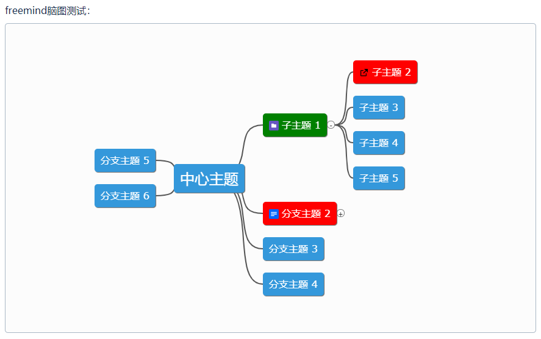
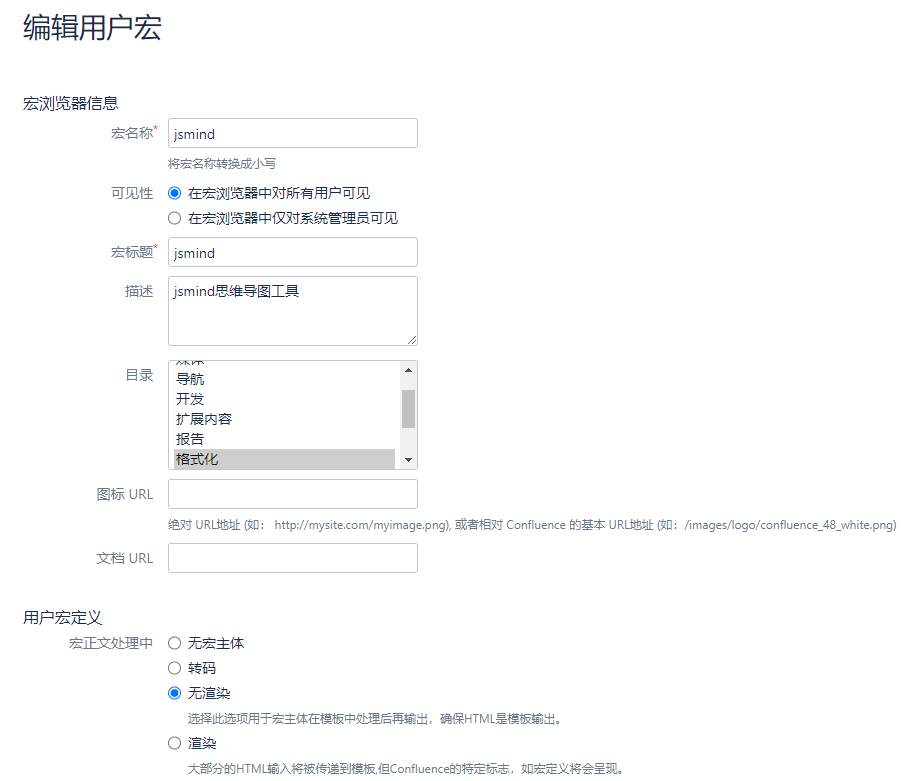
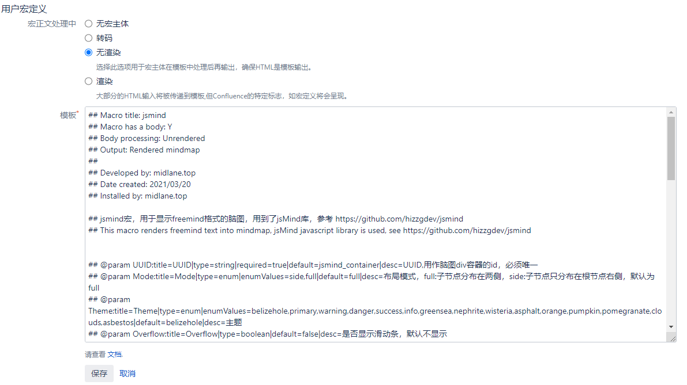
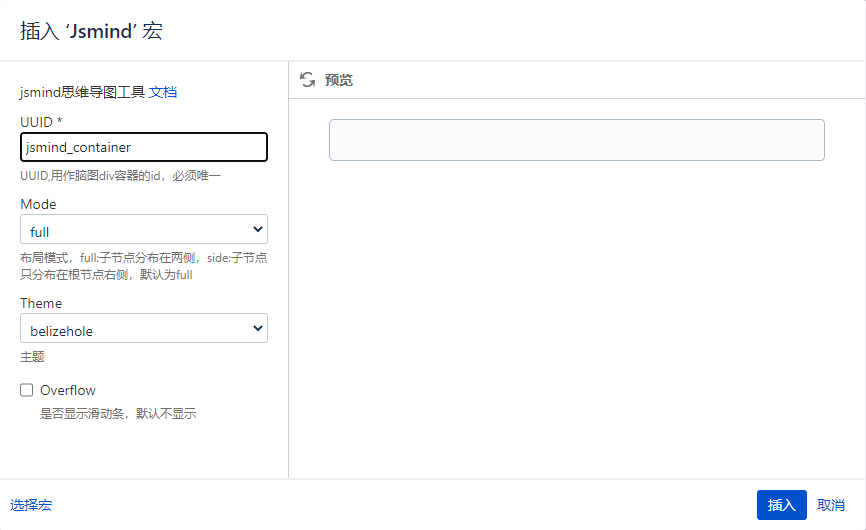
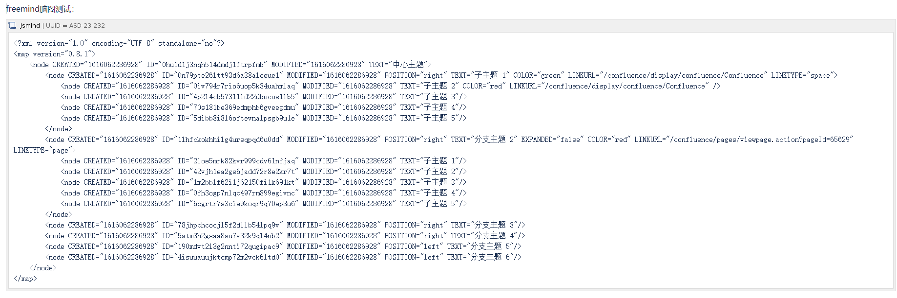

移植jsMind到Confluence Server中，以支持在Confluence页面上插入freemind格式的脑图，效果如下：

方法如下：

1. 添加jsmind宏，按如下选项设置要添加的宏，并在模板中输入jsmind.vm中的内容：

   

   

在使用jsmind宏之前，需要将jsmind.css和jsmind.js引入到Confluence页面中，将这两个文件上传到web根目录并通过Confluence的自定义HTML头部引入。

在页面中插入jsmind宏和freemind格式的脑图文件即可，如下：

